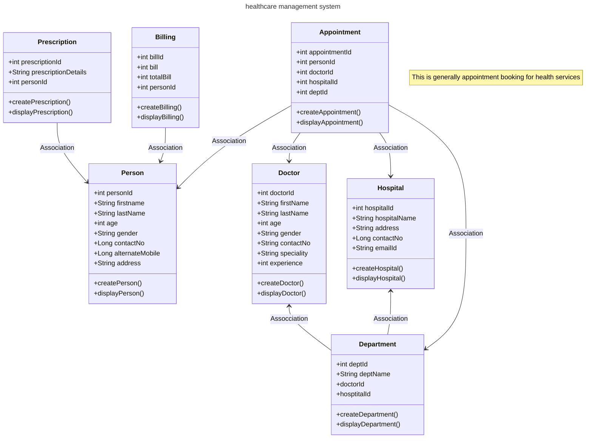

# spring-boot-healthcare-management-system
spring boot project

## Introduction
🚀 Project Overview The spring-boot-healthcare-management-system is a Java-based web application built using Servlet and JSP technologies. It simulates real-world operations such as user registration, patient booking, doctor management, appointment booking, and appointment booking functionalities. This project serves as a hands-on approach to understanding full-stack Java development while applying core concepts like JDBC, MVC, and OOP design principles.

## Features
Key Features 👤 customer, 👨🏻‍⚕️ Doctor,🏥 hospital Registration & 📅appointment.

Register and manage both customer and doctor accounts seamlessly.

📅 appointment booking

Book appointment by selecting 👤 customer,👨🏻‍⚕️ Doctor & 🏥 hospital automatically.

🗃️ CRUD Operations

Perform Create, Read, Update, and Delete operations on all modules.

📈 Admin Dashboard

Customer, Doctor, Hospital,Department,Apointment,Billing,Prescription activity.

## Technologies Used
🛠️ Stack

Java – Core language for backend logic

JSP/Servlet (Jakarta EE) – For handling web requests and building the user interface

JDBC – For database operations

MySQL – Relational database to store system data

HTML/CSS – Frontend structure and styling

JavaScript – Basic client-side interactivity

Apache Tomcat – Servlet container

Maven – Build and dependency management

Git – Version control

## Getting Started
💡 Installation and Setup

## Prerequisites
Java JDK 21

Apache Tomcat 10

MYSQL 8

Maven 3.8

IDE (IntelliJ)

Git (optional)

## Setup MySQL Database
CREATE DATABASE healthcareDatat; USE healthcaredata;

## Configure Your MySQL Connection
jdbc.url=jdbc:mysql://localhost:3306/cab_management jdbc.username=root jdbc.password=your_password jdbc.driver=com.mysql.cj.jdbc.Driver

Compile and Run the Application
locate Main.java in your IDE.

Run the file to launch the application.

Build the project mvn clean install Deploy to Tomcat Server Place the .war file in the webapps folder and start the server.

## Usage
Customer Registration & Login

Book a Appointment

Assign Doctor & Hospital Details

Make a bill

Admin Access to Monitor Activities

## Contributing
Contributions are welcome! Open an issue or submit a pull request. For major changes, please open a discussion first.

## Functionality
Customer

Doctor

Hospital

Department

Appointment

Prescription

Billing

# Package Structure
* com.healthcareApp Contains the main application logic (healthcareApp.java)
* * com.healthcareApp.controller: includes all the controller classes:
  * PersonController.java
  * DoctoController.java
  * HospitalController.java
  * DepartmentController.java
  * AppointmentController.java
  * PrescriptionController.java
  * BillingController.java
* com.helathcareApp.model: includes all the model classes:
  * Person.java
  * Doctor.java
  * Hospital.java
  * Department.java
  * Appointment.java
  * Prescription.java
  * Billing.java
* com.healthcareApp.service: includes all the service classes and interfaces:
   * PersonService.java
   * DoctorService.java
   * HospitalService.java
   * DepartmentService.java
   * AppointmentService.java
   * PrescriptionService.java
   * BillingService.java
   * ConnectionService.java
     
 # Class Diagram

